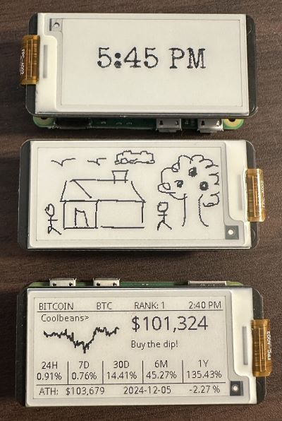
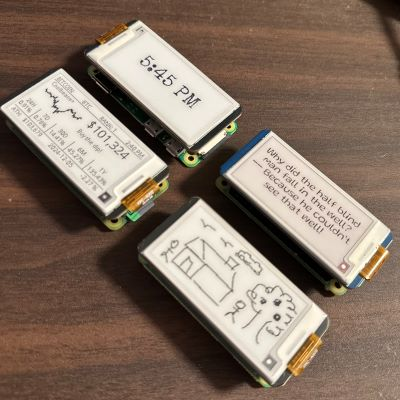
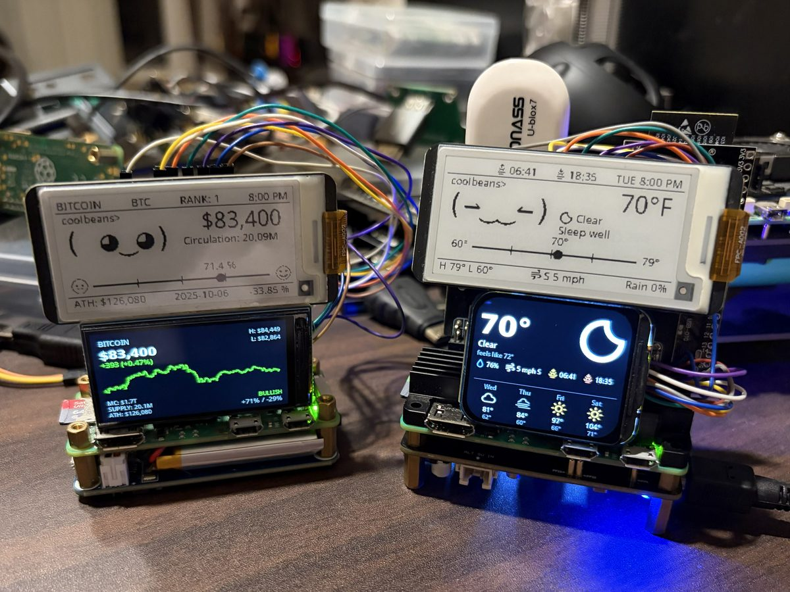

# PiE-ink

A Raspberry Pi with a small e-ink screen, controlled from your phone.

<p>
  
  
  
</p>

Display the time, weather, message, sketch, book, camera feed, crypto
prices or the system stats on an e-ink display. The web page shows exactly what's
on the panel, previews your changes before you send them, and works from any
phone or laptop on your network.

Works with the Waveshare **2.13"** (V3/V4), **2.7"** (V1/V2, with four keys)
and **3.7"** e-Paper HATs, and the PiSugar **Whisplay** HAT (a colour LCD
with a speaker, microphones, a button and an LED). Every screen has a layout
for each size.

This is the short version. [docs/guide.md](docs/guide.md) goes through every
screen, setting and button.

## Parts

- A Raspberry Pi (Zero 2 W through Pi 5) and a [micro SD card](https://amzn.to/4hEMYF4)
- [2.13" e-Paper HAT](https://amzn.to/4zeRSzU) (V3 or V4) | 2.7" e-Paper HAT (V2 recommended) | 3.7" e-Paper HAT,
- [GPIO extender](https://amzn.to/3VeFst4);
- [GPIO splitter](https://amzn.to/3TdY9MU);
Optional:
- [UPS HAT](https://amzn.to/4yvY6LE);
- [Waveshare USB Hat](https://amzn.to/4j0LMye);
- [USB GPS receiver](https://amzn.to/4rMy5oP);
- [Waveshare 1.69"](https://amzn.to/4ALyVWV) or [1.9" LCD](https://amzn.to/4AIERA3) as a second, color screen;
- Pi camera or USB webcam;
- USB speaker;
- USB microphone;

(Amazon affiliate links)

## Install

1. Flash Raspberry Pi OS (Bookworm or newer, Lite is fine) and boot with the
   HAT attached.
2. On the Pi:

   ```bash
   sudo apt install -y git
   git clone https://github.com/frogCaller/piE-ink.git
   cd piE-ink
   ./setup.sh
   ```

3. Open `http://<pi-address>:5000` on your phone. The address is printed at
   the end of `setup.sh`; `http://<hostname>.local:5000` usually works too.

`setup.sh` installs the packages, enables SPI, installs the voice and the
listener (`--no-speech` skips those, about 200 MB), and installs PiE-ink as a
service that is running when it finishes. It doesn't start at boot unless
you ask:

```bash
sudo systemctl enable pie-ink     # start at every boot from now on
./setup.sh --autostart            # same, during install
sudo systemctl stop pie-ink       # stop (puts the panel to sleep)
```

The default panel is the 2.13" V4 — pick yours under **Settings → Screen**.
Swapping HATs later: power off, swap, boot, pick. A Whisplay HAT's sound
card needs `./setup.sh --whisplay` once.

**Updating:** `cd piE-ink && git pull && sudo systemctl restart pie-ink`.
Your settings and files live in `config.yaml` and `data/`, which updates
never touch. **Settings → Pi → Update** runs the Pi's own updates from the
page.

## The page

Pick a tab, adjust, press the button. The preview follows as you change
things; the panel updates when you send. Under the panel, a row of tiles says
what's going on right now; the gear opens the settings; the bar along the
bottom talks to the bot. On a wide screen it's a dashboard — the tabs down
the left, the panel and the tiles across the top, the bot's conversation in
a column on the right.

## Screens

- **Clock** — big, in any font; seconds and the date if you like.
- **Weather** — today, with a face that reacts to the sky, and four days
  ahead. It finds its own location (a USB GPS, or the Pi's internet
  address); type a town if you want somewhere else.
- **Me** — your day: how far into the work block, how long awake, the
  weather, your coin, days to your birthday, with a face that comments.
- **Message** — your own text, or a joke, fortune or topic that changes on
  its own; read out loud if you like.
- **The bot** — your own LLM (Ollama, on the Pi or another machine) on the
  screen, with a face that follows the tone of its answer. It knows the
  time, the weather, your coins and what the camera sees; it speaks through
  a speaker, listens for a wake phrase, and pipes up by itself now and then.
- **Finance** — what today has earned so far, from your yearly figure and
  your schedule.
- **Music** — plays `data/music` through a USB speaker, or through the phone
  you're holding (**Play on this device**).
- **Draw** — pen, shapes, fill, text, photos, undo; dithered to the panel.
  With a second LCD, both canvases sit side by side.
- **Read** — EPUB, TXT and PDF books, CBZ and PDF comics, Project Gutenberg,
  xkcd and the Internet Archive's comics; turn pages from the page or the
  HAT's keys.
- **Camera** — a live view on the page, a frame a second on the panel,
  photos with filters, the other PiE-inks' cameras too.
- **Crypto** — the Cryptogotchi: CoinGecko prices with a face that reacts to
  the market, a graph, your miners (Duino-Coin, Verus) and what you hold —
  with a word from the bot when it passes your line or a day goes badly.
- **GPS** and **Map** — where the Pi is, from a USB receiver, on
  OpenStreetMap, with the day's track.
- **System** — CPU, temperature, memory, disk, IP, uptime.
- **Group chat** — messages and postcards between the PiE-inks on your
  network, and their bots talking to each other.

Under the panel: **Rotate**, **Refresh** (clears ghosting) and **Off**.
**Settings → Cycle** runs a slideshow of the screens you tick.

## What else it does

- **Talks and listens.** A USB speaker gives it a voice
  ([Piper](https://github.com/rhasspy/piper), offline, a voice bundled); a
  USB microphone lets you say "hey cool beans, what's the weather?" — or any
  phrase you set — recognised on the Pi itself. Settings → Sound.
- **Works the house.** With Home Assistant: "turn on the living room tv",
  "channel 5452", "volume up", "open netflix", "turn off the lamp" — said,
  typed or sent from Telegram. Settings → Home.
- **Messages your phone.** A Telegram bot of your own (Settings → Telegram):
  it tells you what the camera saw, when the miners drop out or your crypto
  passes the line, and takes commands — `/screen weather`, `/photo`, `/map`,
  `/tv`, `/holdings`, `/look left`, or just words.
- **Watches the room.** The camera is compared frame to frame and, when
  something changes, a vision model (or OpenCV on the Pi) says what it sees:
  a list of the day's events, a word out loud, a picture to your phone. A
  camera that turns gets a joystick, *look around*, *follow me*, and a
  **little friend** that looks about the room by itself and says hello.
- **Keeps watch for you.** The **agent** (Settings → Agent) reads goals in
  your own words — *tell me if the server goes down, keep an eye on the
  printer* — checks every few minutes, and acts only in the ways you tick.
- **Talks to the other PiE-inks.** Pis on the network find each other:
  message them, send a postcard, see their cameras, ask "which pi has a
  gps", set two bots talking.
- **A second screen.** A Waveshare 1.69" or 1.9" LCD beside the e-ink shows
  system info, the clock, the weather, the map, the GPS, the coin, the
  camera, or a colour painting from the Draw tab. Wiring and pins are in
  the [guide](docs/guide.md#a-second-screen-a-small-colour-lcd).
- **Keys on the 2.7" HAT** — each gets an action under Settings → Screen:
  previous, next, next screen, full refresh, screen off.
- **Fonts** — drop a `.ttf`, `.otf` or `.ttc` into `assets/fonts/` and it
  appears in every font dropdown within seconds.

## Running without a Pi

```bash
PIE_INK_DRIVER=mock python3 app.py      # 2.13" shape
PIE_INK_DRIVER=mock27 python3 app.py    # 2.7" shape
PIE_INK_DRIVER=mock37 python3 app.py    # 3.7" shape
```

Everything works, including the preview; it just doesn't push to a panel.
`python3 selftest.py` renders every screen at every size; `python3
smoketest.py` boots the app and pokes every route, and runs the real e-ink
drivers over a pretend bus.

## Layout

```
app.py                 web server and JSON API
setup.sh               installer (packages, SPI, systemd service)
pie_ink/service.py     the one thread that owns the panel
pie_ink/panels/        the panels: 2.13" V3/V4, 2.7" V1/V2, 3.7", Whisplay, mocks
pie_ink/modes/         the screens
pie_ink/               everything else: camera, sound, listening, the bot, GPS, maps, the agent, the friend…
waveshare_epd/         Waveshare's drivers
assets/                fonts, icons, jokes, fortunes, topics, seed prices
data/                  your books, drawings, coins, photos and cache (made at runtime)
```

The [guide](docs/guide.md#layout) names every file.

## Troubleshooting

- Nothing on the screen: check the HAT is seated and SPI is on
  (`ls /dev/spidev*`), then `journalctl -u pie-ink -f`. The status line
  under the preview shows the last error.
- "No answer from the panel": the driver and the HAT don't match. A 2.7" is
  V1 or V2 (the V2 says so on the board), a 2.13" V3 or V4 — pick the other
  one under Settings → Screen.
- `can not open gpiochip`: `sudo apt install python3-lgpio`, and your user in
  the `gpio` and `spi` groups (`sudo usermod -aG gpio,spi $USER`).
- Ghosting: tap **Refresh**, or lower "Full refresh every".
- A webcam, speaker, microphone or GPS that "isn't working": press **Why not
  found?** on the Camera tab, **Why not working?** by the GPS line on the
  Weather tab, or **Speaker or mic missing?** under Settings → Sound. Each
  checks the USB bus, the drivers and the permissions and says which of the
  usual things it is. On a Zero 2 W it is nearly always power — use a hub
  with its own supply and a data (OTG) adapter.

The [guide](docs/guide.md#troubleshooting) has the rest.

## Credits

- Prices from [CoinGecko](https://www.coingecko.com/en/api); weather from
  [Open-Meteo](https://open-meteo.com/) and the US National Weather Service;
  place names from [Nominatim](https://nominatim.org/); map tiles ©
  [OpenStreetMap](https://www.openstreetmap.org/copyright) contributors,
  drawn with [Leaflet](https://leafletjs.com/) (BSD-2, bundled).
- `waveshare_epd/` is Waveshare's e-Paper library (MIT), with two small
  changes: the wait for the controller gives up after 30 s instead of never,
  and the SPI device isn't reopened on top of itself at every init. The 2.7"
  frames are packed and sent in one transfer by `pie_ink/panels/eink.py`.
- The Whisplay HAT's pin map and panel init values come from
  [PiSugar's driver](https://github.com/PiSugar/whisplay) (Apache-2.0); the
  LCD init sequences follow Waveshare's examples. Voices are
  [Piper](https://github.com/rhasspy/piper) models; listening is
  [Vosk](https://alphacephei.com/vosk/); the bot talks to
  [Ollama](https://ollama.com/).
- Fonts: DejaVu Sans Mono (Bitstream Vera licence), Fredericka the Great,
  Rubik Doodle Shadow, Gravitas One and Gluten (SIL OFL), Special Elite
  (Apache-2.0), 04b_08 (free).
